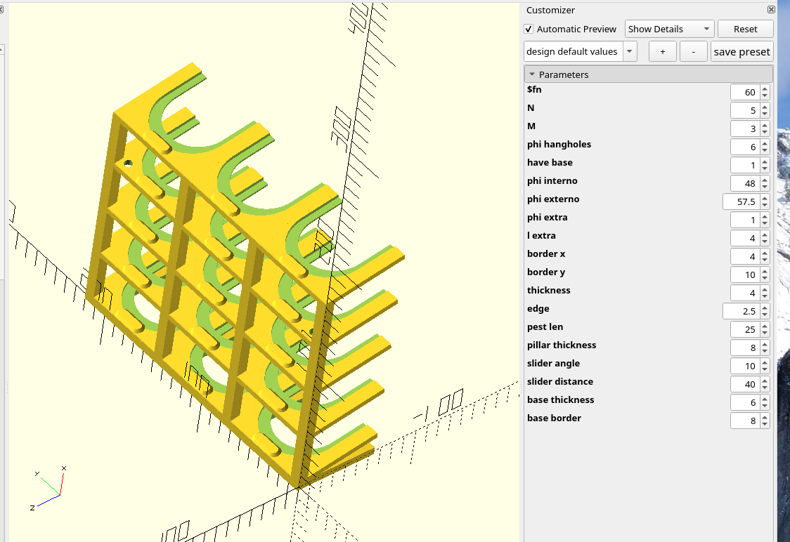
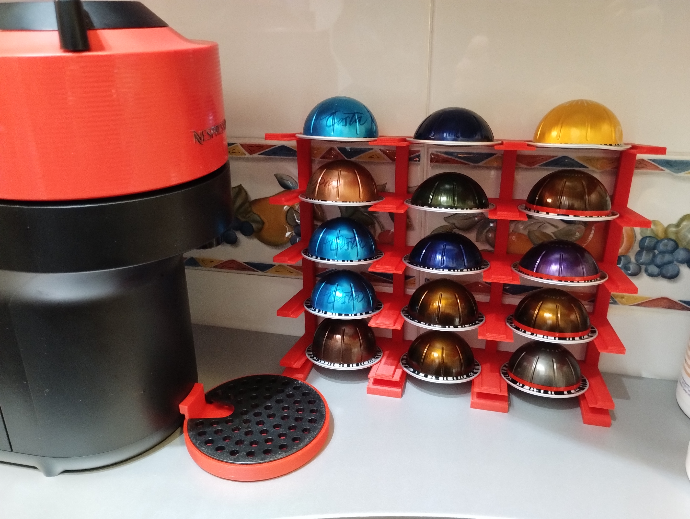
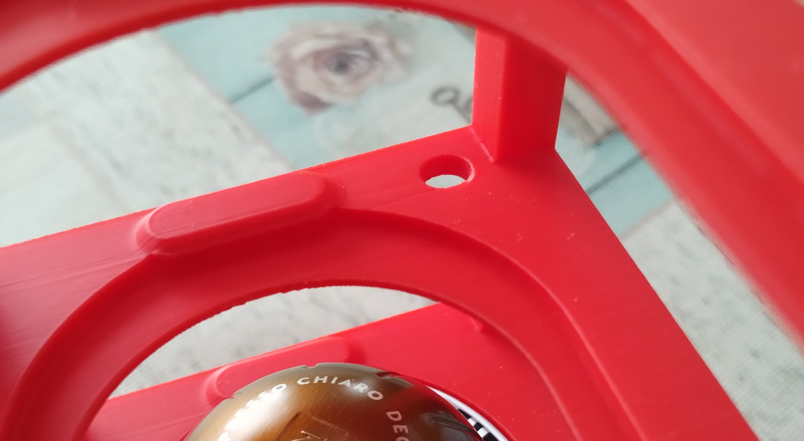
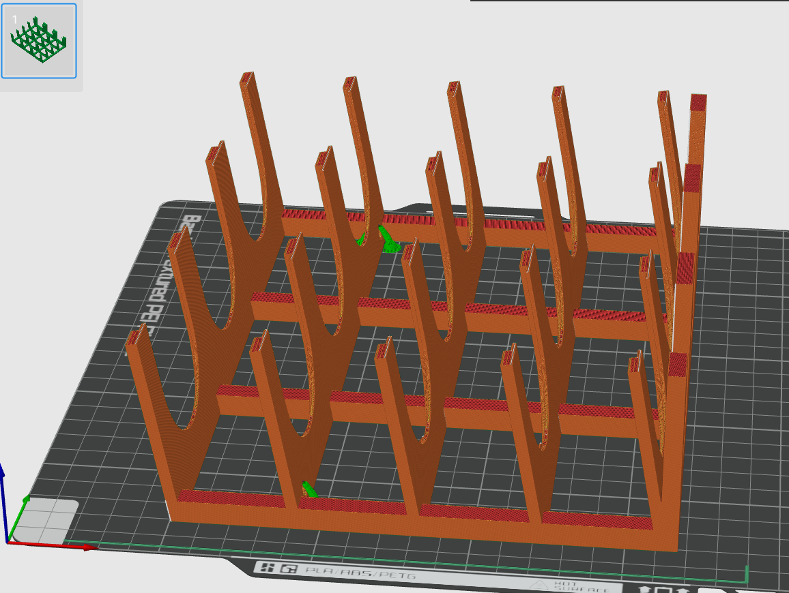

These are my little projects for 3D printers, which I find useful and handy; they are shared here under the [Creative common Attribution-NonCommercial-ShareAlike 4.0 International license](https://creativecommons.org/licenses/by-nc-sa/4.0/deed.en). If you need another license, please contact me.

## NespressoⓇ VertuoⓇ stand

This is a completely parametric design to build a stand for NespressoⓇ  VertuoⓇ 's capsules. I know that there are hundreds of designs around the 'net, but this has some features I could not find in others:

* It's very compact, occupying little more space than the capsules themselves;
* You can access each one of the capsules independently;
* You can choose to have it stand by itself or hang it (see parameters in the code);
* It prints with almost no support material (just a tiny bit for the hanging holes, if presents; just use the flat side as the base).

Look in the [VertuoStand](./VertuoStand) directory for the OpenScad code and the Bambu Studio project for a 3x5 stand as in the photos below.

<table cellspacing="0" cellpadding="0">
<tr>
<td width="20%"></td>
<td width="20%"></td>
<td width="20%"></td>
<td width="20%"></td>
<td width="20%"></td>
</tr>
</table>

Notice the very nice 
[Jake's low profile dip tray](https://makerworld.com/es/models/1999206-nespresso-vertuo-pop-low-profile-drip-tray#profileId-2152357)
on the Pop machine.

## License for all the projects

